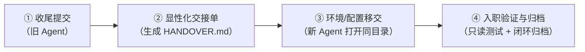

# 🔄 Agent Handover (AI 编程助手项目交接技能包)

[](LICENSE)
[](https://github.com/cg689/agent-handover)
[](#-多-agent-适配矩阵)

[**English**](./README_EN.md) | [**简体中文**](./README.md)

> **项目属于磁盘，不属于任何特定 Agent。换 Agent 是换工人，不是搬项目。**

**Agent Handover** 是一套专为 **AI 编程助手（Agent）** 设计的标准化项目交接技能包与通用操作指南。它解决了在不同 AI 编码工具之间切换时导致的“隐性知识丢失”、“上下文断层”、“新 Agent 乱改代码”以及“多代交接冲突”等工程痛点。

---

## 🌟 核心原则

1. **项目属于存储位置，不属于任何工人**：项目 = 本地文件夹 + Git 版本控制。换 Agent 只是换施工师傅。
2. **只有写进文件的知识能带走**：对话历史、短期会话记忆、工具专有索引缓存，换工具即丢——**必须提前显性化沉淀为 Markdown 文档**。
3. **交接闭环 = 隐性知识显性化 + 运行测试验证 + 生命周期归档**。

---

## 🏗️ 全景四步交接流程



---

## 🚀 极简使用指南（日常只需敲两句话）

整个交接过程已封装为自动化 Skill，你无需记忆繁琐指令：

### 第一步：在【旧 Agent】对话框中
发送：
> **“帮我做项目交接”**

🤖 **旧 Agent 自动执行**：
* 检查 Git 状态并安全提交未完成改动；
* 自动打上带时间戳的防崩回滚点（`git tag handover-before-YYYYMMDD-HHMM`）；
* 自动生成带状态标记的 `HANDOVER.md`（记录技术栈、设计决策、踩坑历史与已知技术债）。

---

### 第二步：在【新 Agent】对话框中
在新工具中打开**同一个项目文件夹**，发送第一句话：
> **“我刚从其他 Agent 切换过来，请按流程入职”**

🤖 **新 Agent 自动执行**：
* 自动进入**只读入职模式**，阅读 `HANDOVER.md` 与项目说明书；
* 自动在终端执行 `安装依赖`、`跑单元测试` 与 `打包构建`，向你汇报项目现状与已知问题；
* 接受你派发的一项受控小任务（改文案/补小测试）；
* **自动完成闭环归档**：将技术事实沉淀到常驻说明书（如 `AGENTS.md` / `CLAUDE.md`），并将 `HANDOVER.md` 移入 `docs/handover/` 归档。

---

## 🧩 多 Agent 适配矩阵

本仓库已为 **10 款主流 AI 编程助手** 提供了专属格式的转译适配包（位于 [`adapted/`](./adapted/) 目录）：

| AI Agent | 适配配置文件位置 | 安装部署方式 | 唤醒/触发方式 |
|---|---|---|---|
| **Google Antigravity** | `adapted/antigravity/` | 放置于 `~/.gemini/config/skills/agent-handover/` | 自动识别激活 |
| **Claude Code** | `adapted/claude-code/` | 复制 `.claude/` 到项目根目录或 `~/.claude/` | 输入 `/agent-handover` |
| **Cursor** | `adapted/cursor/` | 复制 `.cursor/` 到项目根目录 | 在 Composer/Chat 中输入 `@agent-handover` |
| **ChatGPT / Codex** | `adapted/chatgpt-codex/` | 复制 `AGENTS.md` 到项目根目录 | 对话框直接说“帮我做项目交接” |
| **Trae** | `adapted/trae/` | 复制 `.trae/` 到项目根目录 | 对话框直接说“帮我做项目交接” |
| **Workbuddy / CodeBuddy** | `adapted/workbuddy/` | 复制 `.codebuddy/` 到项目根目录 | 对话框直接说“帮我做项目交接” |
| **DeepSeek Harness** | `adapted/deepseek-harness/` | 复制 `AGENTS.md` 到项目根目录 | 对话框直接说“帮我做项目交接” |
| **Hermes** | `adapted/hermes/` | 复制到 `~/.hermes/skills/` | 对话框直接说“帮我做项目交接” |
| **豆包Work (MarsCode)** | `adapted/doubao-work/` | 放入项目内，对话中 `@` 引用 | 输入 `@agent-handover 帮我做交接` |
| **Pi** | `adapted/pi/` | 将指令内容粘贴进会话 | 粘贴即触发 |

---

## 🛡️ 工程防错与生命周期治理

针对多代 Agent 频繁交接的复杂场景，本方案内置了 6 重工程级防御：

* 🔒 **Tag 重名防护**：所有备份 Tag 均强制包含精确时间戳，避免多次交接时命令报错中断。
* 🔒 **防历史覆写**：生成新交接单前，若存在旧文档，强制先备份至 `docs/handover/`，绝不丢失历史决策。
* 🔒 **全生命周期闭环**：验证完成后必须归档 `HANDOVER.md`，防止下次交接时 Agent 误将历史文档当作待接收任务。
* 🔒 **人类强制 Diff 审计**：验收阶段人类人工复核 `git diff`，严防大模型擅自篡改/删除测试断言制造“自测全绿假阳性”。
* 🔒 **严禁硬编码敏感信息**：密钥、Token、私网 IP、真实业务数据一律禁止写入 Markdown，仅记录配置位置。
* 🔒 **Token 治理**：对于常驻加载的平台（如 `AGENTS.md`），明确提示交接完成后恢复常规说明书，避免常驻消耗 Token。

---

## 📁 仓库目录结构

```text
agent-handover/
├── README.md                         # 仓库自述文件
├── SKILL.md                          # 标准 Skill 入口（符合渐进式披露规范）
├── references/                       # 深度参考手册库
│   ├── full_guide.md                 # 2 万字全景交接指南（含资产清单与边界场景）
│   └── QUICK_START.md                # 全真场景对话演练手册
├── resources/                        # 模板库
│   ├── handover_prompt.md            # 轻量版交接提示词
│   ├── step1_cleanup_prompt.md       # 第 1 步收尾提示词
│   ├── step2_handover_prompt.md      # 第 2 步生成文档提示词
│   ├── step4_onboarding_prompt.md    # 第 4 步入职验证提示词
│   └── project_guide_template.md     # 常规项目说明书长效模板
└── adapted/                          # 10 款主流 Agent 的专属适配包
    ├── README.md                     # 适配包说明与 Token 治理指引
    ├── antigravity/
    ├── claude-code/
    ├── cursor/
    ├── chatgpt-codex/
    ├── trae/
    ├── workbuddy/
    ├── deepseek-harness/
    ├── hermes/
    ├── pi/
    └── doubao-work/
```

---

## 📄 开源许可证

本项目遵循 [MIT License](LICENSE) 协议。欢迎自由分发与集成到你的个人或企业工作流中！
