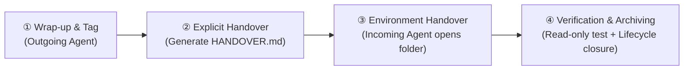

# 🔄 Agent Handover

[](LICENSE)
[](https://github.com/cg689/agent-handover)
[](#-multi-agent-compatibility-matrix)

[**English**](./README_EN.md) | [**简体中文**](./README.md)

> **Projects belong to the disk, not to any specific Agent. Changing Agents is like changing construction workers, not moving the building.**

**Agent Handover** is a standardized project transition skill package and operational playbook designed for **AI Coding Assistants (Agents)**. It solves critical engineering pain points when switching between different AI tools, including implicit knowledge loss, context fragmentation, unintended code regressions by new agents, and multi-generational handover collisions.

---

## 🌟 Core Principles

1. **Projects belong to their storage, not any worker**: A project = Local Disk Directory + Git Version Control. Switching agents is simply changing the worker on site.
2. **Only knowledge committed to files survives**: Conversation history, short-term memory, and proprietary tool index caches are lost upon tool migration—**implicit knowledge must be made explicit in Markdown**.
3. **Handover Lifecycle = Explicit Documentation + Automated Testing + Lifecycle Archiving**.

---

## 🏗️ The 4-Step Handover Workflow



---

## 🚀 Quick Start Guide (Only Two Prompts in Daily Work)

The entire handover procedure is fully encapsulated into an automated Skill:

### Step 1: In the 【Outgoing Agent】
Send:
> **"Help me perform a project handover."**

🤖 **The Outgoing Agent automatically**:
* Inspects Git status and safely commits all pending changes;
* Creates a timestamped rollback tag (`git tag handover-before-YYYYMMDD-HHMM`);
* Generates a metadata-tagged `HANDOVER.md` (recording tech stack, architectural decisions, past pitfalls, and known technical debt).

---

### Step 2: In the 【Incoming Agent】
Open the **same project folder** in the new tool, and send:
> **"I just switched over from another Agent. Please proceed with onboarding."**

🤖 **The Incoming Agent automatically**:
* Enters **Read-Only Onboarding Mode**, parsing `HANDOVER.md` and repository instructions;
* Automatically runs `dependency install`, `unit tests`, and `build` commands in the terminal, reporting current project health and known issues;
* Waits for your controlled small task assignment (e.g., text fix or single test addition);
* **Completes the lifecycle closure**: Backfills technical facts into permanent rule files (e.g., `AGENTS.md` / `CLAUDE.md`) and archives `HANDOVER.md` to `docs/handover/`.

---

## 🧩 Multi-Agent Compatibility Matrix

Dedicated adapter configurations for **10 mainstream AI coding tools** are provided in the [`adapted/`](./adapted/) directory:

| AI Agent | Adapted Configuration Path | Deployment Method | Trigger Command |
|---|---|---|---|
| **Google Antigravity** | `adapted/antigravity/` | Place in `~/.gemini/config/skills/agent-handover/` | Auto-detected & loaded |
| **Claude Code** | `adapted/claude-code/` | Copy `.claude/` to repo root or `~/.claude/` | `/agent-handover` |
| **Cursor** | `adapted/cursor/` | Copy `.cursor/` to repo root | Type `@agent-handover` in Composer/Chat |
| **ChatGPT / Codex** | `adapted/chatgpt-codex/` | Copy `AGENTS.md` to repo root | Say "Help me do project handover" |
| **Trae** | `adapted/trae/` | Copy `.trae/` to repo root | Say "Help me do project handover" |
| **Workbuddy / CodeBuddy** | `adapted/workbuddy/` | Copy `.codebuddy/` to repo root | Say "Help me do project handover" |
| **DeepSeek Harness** | `adapted/deepseek-harness/` | Copy `AGENTS.md` to repo root | Say "Help me do project handover" |
| **Hermes** | `adapted/hermes/` | Copy to `~/.hermes/skills/` | Say "Help me do project handover" |
| **Doubao Work (MarsCode)** | `adapted/doubao-work/` | Place in repo, reference via `@` | Type `@agent-handover` |
| **Pi** | `adapted/pi/` | Paste instruction text into conversation | Trigger upon paste |

---

## 🛡️ Engineering Safeguards & Lifecycle Governance

Engineered for multi-generational Agent handovers with 6 enterprise-grade safeguards:

* 🔒 **Timestamped Tag Collisions Protection**: Rollback tags strictly include timestamps (`handover-before-YYYYMMDD-HHMM`) to prevent Git tag collision failures.
* 🔒 **History Overwrite Defense**: Outgoing agents must back up pre-existing `HANDOVER.md` files to `docs/handover/` before generating a new snapshot.
* 🔒 **Full Lifecycle Closure**: `HANDOVER.md` is archived post-onboarding, preventing subsequent agents from mistaking legacy documents for pending transitions.
* 🔒 **Mandatory Human Git Diff Audit**: Human engineers review `git diff` during phase B verification, preventing AI from modifying test assertions to fabricate "false positive green tests".
* 🔒 **Strict Sensitive Data Boundaries**: Plaintext secrets, private IPs, and real user data are forbidden in docs; only configuration references are recorded.
* 🔒 **Token Budget Governance**: Instructions for resident config platforms (e.g., `AGENTS.md`) guide users to restore clean development specs post-handover to minimize permanent token bloat.

---

## 📁 Repository Structure

```text
agent-handover/
├── README.md                         # Chinese Documentation
├── README_EN.md                      # English Documentation
├── SKILL.md                          # Standard Skill Entrypoint (Progressive Disclosure)
├── references/                       # In-depth Reference Guides
│   ├── full_guide.md                 # Universal Handover Playbook & Guidelines
│   └── QUICK_START.md                # Real-world Rehearsal & Troubleshooting Manual
├── resources/                        # Prompt & Content Templates
│   ├── handover_prompt.md            # Lightweight Handover Prompt Template
│   ├── step1_cleanup_prompt.md       # Step 1 Wrap-up Prompt Template
│   ├── step2_handover_prompt.md      # Step 2 Snapshot Prompt Template
│   ├── step4_onboarding_prompt.md    # Step 4 Onboarding Prompt Template
│   └── project_guide_template.md     # Permanent Project Guide Template
└── adapted/                          # Dedicated Adapters for 10 Mainstream Agents
    ├── README.md                     # Adapter Usage & Token Governance
    ├── antigravity/
    ├── claude-code/
    ├── cursor/
    ├── chatgpt-codex/
    ├── trae/
    ├── workbuddy/
    ├── deepseek-harness/
    ├── hermes/
    ├── pi/
    └── doubao-work/
```

---

## 📄 License

Distributed under the [MIT License](LICENSE). Feel free to adapt and integrate into your personal or enterprise AI workflows!
