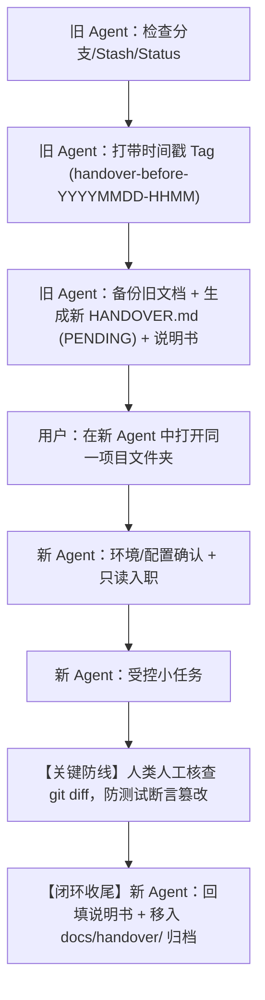

# Agent 项目交接 Skill — 多 Agent 适配包

本目录包含 **agent-handover** 交接技能的多 Agent 适配版本。

## 核心设计：全生命周期闭环与工程防错

为了确保在复杂、多代 Agent 交接场景下的绝对可靠性，本技能内置了以下工程防错机制：

1. **状态元信息管理**：旧 Agent 生成 `HANDOVER.md`，顶部强制标记 `交接状态: PENDING`。
2. **防覆写归档保障**：旧 Agent 生成新交接前，若存在旧文档，强制先备份归档至 `docs/handover/`，绝不丢失历史设计决策与踩坑经验。
3. **带时间戳的回滚点**：收尾打 Tag 强制采用 `handover-before-YYYYMMDD-HHMM`，避免多次交接产生 Tag 冲突中断。
4. **Git 提交与暂存防护**：提交前核对 `git status` 与 `git stash list`，杜绝未忽略的构建缓存或临时垃圾入库。
5. **人类 Diff 强制审计**：受控小任务通过后，人类必须审查 `git diff`，严防 AI 擅自修改测试断言产生“自测全绿假阳性”。
6. **归档闭环**：新 Agent 验证通过后，将技术事实沉淀到说明书，并自动将 `HANDOVER.md` 归档移入 `docs/handover/`（或更新状态为 `COMPLETED`），提交 git 闭环。

---

## 各 Agent 适配文件一览

| Agent | 适配文件位置 | 安装方式 | 触发方式 | Token 治理提示 |
|-------|------------|---------|---------|---|
| **Antigravity** | `adapted/antigravity/` | 复制到 `~/.gemini/config/skills/agent-handover/` | 自动激活 | 按需加载，不占日常 Token |
| **Claude Code** | `adapted/claude-code/` | 复制 `.claude/skills/agent-handover/` 到项目根目录（或 `~/.claude/skills/`） | 输入 `/agent-handover` 或对话触发 | 按需加载，不占日常 Token |
| **Cursor** | `adapted/cursor/` | 复制 `.cursor/rules/agent-handover.mdc` 到项目根目录 | 在 Composer / Chat 中键入 `@agent-handover` | `alwaysApply: false`，按需引用 |
| **ChatGPT / Codex** | `adapted/chatgpt-codex/` | 临时放入根目录 `AGENTS.md` | 对话中说"帮我做项目交接" | ⚠️ **交接完成后请替换为常规项目说明书**，避免常驻消耗 Token |
| **DeepSeek Harness** | `adapted/deepseek-harness/` | 临时放入根目录 `AGENTS.md` | 对话中说"帮我做项目交接" | ⚠️ **交接完成后请替换为常规项目说明书**，避免常驻消耗 Token |
| **Trae** | `adapted/trae/` | 复制 `.trae/rules/agent-handover.md` 到项目根目录 | 对话中说"帮我做项目交接" | 项目级规则按需匹配 |
| **Workbuddy / CodeBuddy** | `adapted/workbuddy/` | 复制 `.codebuddy/rules/agent-handover.md` 到项目根目录 | 对话中说"帮我做项目交接" | 规则目录按需匹配 |
| **Hermes** | `adapted/hermes/` | 复制 `skills/agent-handover.md` 到 `~/.hermes/skills/` | 自动加载 / 对话中说"帮我做项目交接" | 独立技能文件 |
| **Pi** | `adapted/pi/` | 将 `agent-handover-instructions.md` 内容粘贴给 Pi | 粘贴即触发 | 单次会话生效 |
| **豆包Work** | `adapted/doubao-work/` | 放入项目中，对话中输入 `@` 引用该文件 | @ 引用即触发 | 按需引用 |

---

## 核心流程速览

## 注意事项

- 所有适配版本的**指令逻辑完全一致**，针对不同 Agent 的加载机制做了格式适配。
- 交接文档中**绝不记录明文密钥、Token、私网内网 IP 或真实业务测试数据**，只记录配置位置和获取方式。
- Windows 平台下如果未开启开发者模式，请直接复制说明文件，避免使用软链接导致权限报错。
