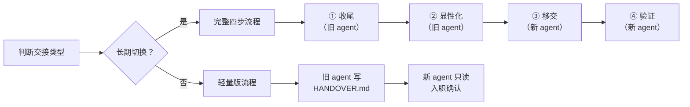

# Agent 项目交接通用指南

> **版本**：v2.0 &nbsp;|&nbsp; **维护人**：（填写） &nbsp;|&nbsp; **最后更新**：2026-08-26
> **适用范围**：任何使用 AI 编程助手（Agent）开发的项目，在更换 Agent 工具或跨团队交接时参考。

---

## 一、三个核心原则

1. **项目不属于任何 agent，项目属于它的存储位置（本地磁盘或远程仓库）。**
   项目 = 一个文件夹 + 版本控制记录（git）。所有 agent 都只是在同一个文件夹里干活的"工人"。换 agent 不是搬项目，是换工人。

2. **agent 的记忆分多种，只有写进文件的能带走。**
   - **显性知识**：写在文件里的东西（代码、注释、文档、提交记录）——新 agent 都能看到。
   - **隐性知识**：只存在于旧 agent 会话里的东西（为什么这么设计、踩过什么坑、下一步打算）——**换工具即丢失，必须提前落到纸面**。
   - **注意**：部分 agent 有长期记忆存储（如 Claude 的 memory、Cursor 的 long-term memory）、项目索引缓存等。这些**不是显性知识**——它们绑定在特定 agent 上，换 agent 同样丢失。对待方式和隐性知识一样：重要的提前写进文件。

3. **交接的本质 = 把隐性知识显性化 + 验证新 agent 没接错。**
   上面两条推出这条。所有步骤都是围绕它展开的。

---

## 二、交接的资产清单

交接前先想清楚，有五类东西要处理：

| 资产 | 存在哪 | 怎么交接 |
|------|--------|----------|
| 代码与改动 | 磁盘 + git | 提交（commit/push）即安全 |
| 项目约定与隐性决策 | 旧 agent 的会话记忆、长期记忆 | 写成文档（这一步最容易漏） |
| 项目运行必需的配置 | .env 文件、密钥、数据库连接等 | **必须迁移**或在新 agent 重新配置 |
| 工具链与 MCP 配置 | Agent 配置目录中的 MCP server 定义、插件列表、自定义工具等 | 按新 agent 的格式**重新配置**（通常无法直接复制） |
| 本地数据与持久化缓存 | SQLite 数据库、向量索引库（Chroma/Milvus）、本地模型权重缓存 | 明确记录数据路径、迁移或重新初始化方式 |
| 个人偏好配置 | 各 agent 自己的配置目录/缓存 | 留旧建新，不迁移 |

> **关键区分**：
> - ✅ **必须跟着走的**：环境变量、密钥、连接器、MCP 配置、本地数据库配置——否则新 agent 连依赖都装不上、服务起不来。
> - ⏭️ **不用迁移的**：主题、快捷键、本地会话历史、旧 agent 专用索引缓存等"个人偏好类"。

> ⚠️ **安全提醒**：密钥、Token、私网内网 IP、测试机账号密码、真实未脱敏业务数据等敏感信息**绝不可写入交接文档或提交到 git**。交接文档中只记录"密钥在哪个文件、找谁获取"，不记录敏感数据本身。确认 `.env`、测试数据等已加入 `.gitignore`。

---

## 三、流程总览



### 选择流程版本

| 场景 | 推荐流程 | 预估耗时 |
|------|---------|---------|
| 临时试用另一个 agent，不停用旧的 | **轻量版** | 15-30 分钟 |
| 小项目（< 5 个文件）长期切换 | 完整四步 | 30-60 分钟 |
| 中型项目长期切换 | 完整四步 | 1-3 小时 |
| 大型项目（多模块、有 CI/CD）| 完整四步 | 半天到一天 |

---

## 四、轻量版流程（临时试用 / 双 agent 并行）

适用场景：不停用旧 agent，只是临时在新 agent 里试跑项目。

1. **旧 agent 检查 git 状态**，确认无遗留 stash 与未忽略垃圾文件，提交所有改动。
2. **旧 agent 写精简版 HANDOVER.md**（包含顶部元信息 `交接状态: PENDING`，以及项目简介、技术栈、常用命令、当前进度、已知问题）。
3. **在新 agent 中打开同一个项目文件夹**，阅读 HANDOVER.md，运行构建/测试确认项目可用。
4. **新 agent 做只读入职汇报**，你确认理解无误后即可开始试用。
5. **试用期结束后决定**：
   - 要长期切换 → 补走完整流程的第 2-4 步；
   - **不切换（继续留在旧 agent）** → **立即删除根目录的 `HANDOVER.md`** 并清理新 agent 缓存，恢复干净状态，避免残留脏标志误导下次交接。

> 💡 轻量版的核心原则：**旧 agent 不停用、新 agent 只试用、改动仍在旧 agent 里提交；试用放弃必须清理 HANDOVER.md**。两个 agent 不要同时改文件。

---

## 五、完整四步流程

### 第 1 步：收尾（在旧 agent 里做）

**目的：让磁盘上的项目处于一个"干净、完整、随时可交接"的状态。**

- 项目还没有版本控制的话，先 `git init` 并做首次提交。
- 确认当前所在分支（`git branch --show-current`）及无遗留暂存（`git stash list`）。
- **核对 `git status`**：确保临时日志、构建产物、大文件或敏感缓存已被 `.gitignore` 排除，再执行暂存提交。
- 确认没有半成品：写了一半的代码要么写完，要么明确标注"进行中"。
- 本地能跑通的基本验证（构建/测试）要在提交前确认；**如果本来就有历史失败项，如实记录哪些是历史遗留、哪些是本次新引入，别硬求全绿。**
- **打回滚点**：`git tag handover-before-$(date +%Y%m%d%H%M)`（带时间戳避免 Tag 命名冲突）或新建回滚分支。

给旧 agent 的提示词模板：

```
请做交接收尾，逐项完成并汇报：

1. 确认当前 Git 分支名称与 stash 列表，检查 `git status` 确保无未忽略的临时/构建/敏感文件后，将改动全部提交到 git（提交信息写清楚改动内容）。
2. 打一个带时间戳的 git tag：`git tag handover-before-$(date +%Y%m%d%H%M)`（如在 Windows 可用 `git tag handover-before-20260829-1900` 格式）。
3. 运行测试和构建，确认当前项目状态；如有失败项，区分"历史遗留"和"本次新引入"并说明。
4. 如有远程仓库，执行推送（含 tag）。
5. 汇报：当前分支、本次提交了什么、项目当前状态、有没有你没做完的事。
```

### 第 2 步：显性化（在旧 agent 里做，最容易漏的一步）

**目的：把旧 agent 脑子里的东西全部倒出来，写成文件。**

> ⚠️ 顺序有讲究：
> 1. **必须先做完第 1 步（代码收干净）再写文档**。否则交接文档里的"当前状态""进行中工作"会失真。
> 2. **若根目录已存在历史 `HANDOVER.md`**，必须先将其备份移入 `docs/handover/`（先执行 `mkdir -p docs/handover`），**绝不可直接原地覆写**，避免丢失上次沉淀的设计决策与踩坑记录。

让旧 agent 写两份文档：

**① 交接文档（`HANDOVER.md`）**——一次性快照，记录"项目现在怎么样"：

```
请把项目现状写成交接文档 HANDOVER.md，放在项目根目录（若已有旧文档请先备份归档至 docs/handover/），并在顶部包含元信息头：

---
交接状态: PENDING
交接时间: YYYY-MM-DD
交出方: [当前 Agent 名称]
接收方: [目标 Agent 名称 / 待定]
---

文档内容包括：
1. 项目是什么、给谁用的、当前进行到哪个阶段
2. 技术栈（语言、框架、数据库、部署方式）
3. 目录结构说明（每个主要目录的职责）
4. 已完成的功能清单
5. 进行中 / 未完成的工作（含优先级）
6. 已知问题与技术债（每条标注"是否已绕过"和"优先级"）
7. 踩过的坑与重要教训（含复现条件和规避方案）
8. 重要设计决策及其原因（为什么这么做，而不只是做了什么）
9. 安全红线与不可违反的约定
10. 常用命令（安装依赖 / 跑测试 / 构建 / 部署）
11. 工具链与持久化配置（使用了哪些 MCP server、自定义工具、本地数据库路径与缓存处理）

注意：不要在文档中写入任何明文密钥、Token、私网 IP 或真实业务测试数据。只记录"配置在哪个文件、找谁获取"。
```

**可选**：导出旧 agent 的会话历史（如支持），作为隐性知识的追溯备份存放在 `docs/handover/` 下。这不替代 HANDOVER.md，但在日后追查"当时为什么这么做"时可能有用。

**② 项目说明书**——长期有效，记录"在这个项目干活要守什么规矩"。文件名按新 agent 的约定来（见下方对照表），内容模板：

```markdown
# 项目说明书（所有 agent 必读）

## 项目简介
（一两句话：这是什么项目、给谁用的）

## 安全红线（不可违反）
- 不可为通过测试而降级安全设置
- 不可在文档或代码中硬编码密钥/token
- 不可造假数据
- （按项目实际情况补充）

## 目录结构
（每个主要目录的职责，从 HANDOVER.md 稳定后回填）

## 依赖与环境
- 运行时版本：...
- 包管理器：...
- 环境变量 / 密钥在哪个文件、如何获取：...

## 工具链配置
- MCP Server：...（配置文件路径、用途）
- CI/CD：...（平台、配置文件路径）
- 其他自定义工具：...

## 常用命令
- 安装依赖：...
- 跑测试：...
- 构建：...
- 部署：...

## 测试约定
- 改完必须跑哪些测试
- 测试文件放在哪、怎么命名

## 提交与分支约定
- commit message 规范
- 分支策略 / PR 流程

## 工作约定
- 改动前先说明方案，确认后再动手
- 每次改动必须附带测试结果
- （按团队习惯补充）
```

**两份文档的分工与联动：**

| | HANDOVER.md | 项目说明书 |
|--|-------------|-----------|
| 性质 | **快照**——阶段性状态 | **长效**——稳定事实 |
| 内容 | 进行中、未完成、技术债、本次设计决策 | 目录结构、命令清单、环境配置、提交规范 |
| 更新频率 | 每次大交接时更新 | 随项目演进持续维护 |
| 联动规则 | HANDOVER.md 中"稳定下来"的内容 → **回填到项目说明书**，避免两份文档各写各的 |

### 第 3 步：移交（在新 agent 那边做）

- 在新 agent 中**打开同一个项目文件夹**（agent 有自己的安装位置，与项目目录无关）。不复制项目、不新建项目。
- 说明文件放在新 agent 默认会读的位置（文件名/路径按目标 agent 约定，见下方对照表）。
- **项目运行必需的配置**（环境变量、密钥、连接器）要迁移或在新 agent 重新配置，否则项目跑不起来。
- **工具链配置**（MCP server、自定义工具）按新 agent 的格式重新配置；旧配置文件保留备查。
- 远程仓库：在新机器上 clone/pull 到本地，确认推送、拉取权限正常。
- 旧 agent 留下的个人偏好配置目录**验证通过前先留着**（便于回滚），验证通过后再清理。

#### 常见 Agent 读取的说明文件名（对照表）

| Agent              | 自动读取的说明文件                            | 备注                      |
| ------------------ | ------------------------------------ | ----------------------- |
| Claude Code        | `CLAUDE.md`                          | 支持子目录下的分层 `CLAUDE.md`   |
| OpenAI Codex       | `AGENTS.md`                          |                         |
| Cursor             | `.cursorrules`                       | 也支持 `.cursor/rules/` 目录 |
| Windsurf           | `.windsurfrules`                     |                         |
| GitHub Copilot     | `.github/copilot-instructions.md`    |                         |
| Google Antigravity | `GEMINI.md` 或自定义 rules               |                         |
| Cline              | `.clinerules`                        |                         |
| Aider              | `.aider.conf.yml` / `CONVENTIONS.md` |                         |
| Trae               | `.trae/rules`                        |                         |

> 💡 Agent 生态变化很快，上表可能过时。迁移时务必查阅目标 Agent 的最新官方文档确认说明文件名和路径。如果项目需要支持多个 Agent，可以为每个 Agent 各建一份说明文件（Windows 系统下无开发者模式时软链接会报错，建议直接复制文件或建硬链接）。

### 第 4 步：验证（新 agent 的第一个任务是"只读入职 + 受控小任务"）

**目的：确认新 agent 理解的项目和实际一致，才让它放手干。**

**阶段 A：只读入职**

给新 agent 的入职提示词模板：

```
你是本项目的执行工程师，刚接手一个进行中的项目。请先完成入职熟悉，全程只读、不修改任何文件：

1. 阅读 HANDOVER.md（交接文档，确认状态为 PENDING）和项目根目录的说明文件。
2. 浏览目录结构，说明你对项目架构的理解。
3. 运行安装依赖、测试、构建的标准命令，确认项目当前是可用状态。
4. 汇报：项目现状、你发现的问题或与交接文档不符的地方。

完成汇报并经我确认后，才开始接受受控小任务。
```

核对它的汇报：说错了就纠正，说对了才继续下一步。**这份汇报是交接质量的第一道验收单。**

**阶段 B：受控小任务与人类审查（防 AI 自测作弊/假阳性）**

只读能证明"读懂了"，受控小任务才能证明"不会接错"。

挑选一个**范围明确、结果可验证**的小改动：

| ✅ 适合做验证的任务 | ❌ 不适合做验证的任务 |
|--------------------|---------------------|
| 修复一个已知的小 bug（如 UI 文案错误） | 重构核心模块 |
| 补一条单元测试 | 添加全新功能 |
| 在已有接口上加一个小字段 | 修改数据库 schema |
| 更新一段过时的文档 | 涉及多个模块的联动改动 |

核对新 agent 是否：
- 按项目说明书的约定动手（提交规范、跑测试）；
- 没碰范围外的东西；
- 结果符合预期。

> ⚠️ **人类强制审计（关键防线）**：不要仅凭 Agent 自行汇报"测试通过"就放行。**人类必须查看 `git diff`**，重点确认 Agent **没有擅自篡改/删除断言以虚假通过测试**，确认实现逻辑合理。

**阶段 C：交接闭环与归档（关键！）**

验证通过后，新 agent 必须完成收尾闭环，避免阻碍未来的下一次交接：
1. 将 `HANDOVER.md` 中稳定下来的技术事实（目录结构、环境配置、常用命令等）**回填沉淀到项目说明书**（如 `AGENTS.md` / `CLAUDE.md` 等）。
2. **将 `HANDOVER.md` 归档移走**：先确保归档目录存在（如 `mkdir -p docs/handover`），再移至 `docs/handover/HANDOVER_YYYYMMDD_<交出方>_to_<接收方>.md`（或将头部状态更新为 `COMPLETED`）。
3. 提交本次入职验证及归档修改到 git。

**完成上述所有阶段，本次交接才算圆满结束。**

---

## 六、红线

1. **新旧 agent 不要同时在同一目录改文件。** 旧 agent 收尾提交完就"停用"（进入只读顾问期），否则改动互相覆盖、git 历史混乱。
2. **会话记忆不会自动迁移。** 别假设新 agent"应该知道"任何事——它只知道文件里写的。
3. **交接文档中不可包含明文密钥或敏感信息。** 密钥、Token、私网 IP、测试密码等只记位置和获取方式，不记录具体数值。
4. **没有回滚点不要开始交接。** 必须先打带时间戳的 `git tag` 或建分支，再动手。
5. **不要跳过验证与人类 Diff 审计步骤。** 即使新 agent 汇报全绿，必须人工复核 `git diff`。
6. **交接完成后必须归档或标记 HANDOVER.md**，绝不可遗留未闭环的活跃交接状态。

---

## 七、常见坑

1. **不要靠复制对话记录来交接。** 几百轮对话里 90% 是噪音，新 agent 没有耐心也没有上下文去读。正确做法是让旧 agent 自己提炼成文档（它最清楚哪些是重点）。
2. **交接文档是快照，说明书是长效。** HANDOVER.md 会过时（每次大交接后更新即可），项目说明书应随项目约定演进持续维护。
3. **项目还没有本地文件夹时，先落盘。** 若旧工具是云端工作区、项目不在你电脑上，第一步是完整导出到本地文件夹并建立 git 记录（`git init` + 首次提交），再走上面的流程。
4. **交接不是一次性的。** 后续重要决策要继续写入文档（回填项目说明书 / 更新 HANDOVER.md），而不是只留在对话里——否则下次交接又从头来。
5. **MCP / 工具链配置容易遗漏。** 很多 agent 的能力依赖额外配置的 MCP server 或插件，这些不在代码仓库里，换 agent 时要单独处理。
6. **项目说明书命名别搞混。** `AGENTS.md` 是 OpenAI Codex 的约定，`CLAUDE.md` 是 Claude Code 的约定——别建错文件导致新 agent 读不到。
7. **交接文档生命周期未闭环。** 交接完成后未归档或未标记 `HANDOVER.md`，导致后续项目再次迁移时，下一个 Agent 误将历史文档当作待接收任务。

---

## 八、回滚与应急

交接是高风险动作，别假设一次成功：

- **打回滚点**：交接前在第 1 步就打带时间戳的 Tag（如 `git tag handover-before-20260829-1900`），新 agent 搞砸了能一键回退：
  ```bash
  git checkout <对应的-tag-名称>   # 回到交接前的状态
  ```
- **保留旧 agent 顾问期**：旧 agent 停用后保留 1-2 周"只读顾问期"——能查旧会话、回答"为什么这么设计"，但不再改文件。
- **发现遗漏别硬补**：不要在新 agent 里凭记忆补漏，回旧 agent 让它把遗漏写成文档，再带回来。
- **验证失败怎么办**：如果新 agent 的只读汇报明显偏离事实，先排查是文档写得不清楚还是 agent 理解能力不足。前者回第 2 步补充文档，后者考虑换一个 agent 或调整提示方式。

---

## 九、特殊场景

### 9.1 同 Agent 版本升级

Agent 大版本升级（如 v1 → v2）有时也需要"交接"：
- 检查配置文件格式是否有 breaking change
- 项目说明书的读取路径/文件名是否有变化
- 长期记忆、项目索引是否需要重建

通常不需要完整四步，但建议：升级前打 tag → 升级后跑一遍构建测试 → 确认说明文件被正确读取。

### 9.2 多人团队协作

当团队中多人使用不同 Agent 协作同一项目时：
- 项目说明书**可以为每个 Agent 各建一份**（内容相同，文件名不同），或使用符号链接
- HANDOVER.md 由**最后一个做重大变更的人**负责更新
- 约定一个"权威版本"的说明文件（如 `PROJECT_GUIDE.md`），其他 Agent 专用文件从它派生

### 9.3 云端工作区 → 本地

1. 完整导出项目文件到本地文件夹
2. `git init` + 首次提交（如云端已有 git，则 `git clone`）
3. 确认构建/测试能在本地通过
4. 然后走正常的完整四步流程

---

## 十、交接完成自检清单

| 步骤 | 检查项 | 责任人 |
|------|--------|--------|
| ① 收尾 | 所有改动已 commit（有远程仓库则已 push） | 旧 agent |
| ① 收尾 | 已打回滚 tag/分支（`handover-before`） | 旧 agent |
| ① 收尾 | 测试/构建在收尾时确认通过（历史失败项已如实记录） | 旧 agent |
| ② 显性化 | 交接文档（HANDOVER.md）已写好，含设计决策原因和技术债 | 旧 agent |
| ② 显性化 | 交接文档中无明文密钥或敏感信息 | 人类复核 |
| ② 显性化 | 项目说明书已建好（文件名按目标 agent 约定） | 旧 agent |
| ③ 移交 | 项目运行必需的配置已迁移或重新配置 | 人类 |
| ③ 移交 | 工具链 / MCP 配置已在新 agent 中重新配置 | 人类 |
| ③ 移交 | 新 agent 能在项目目录正常启动，并能读到两份文档 | 新 agent |
| ④ 验证 | 新 agent 已完成只读入职汇报，理解与实际一致 | 人类验收 |
| ④ 验证 | 新 agent 已完成受控小任务，结果符合预期 | 人类验收 |
| ④ 验证 | 已完成技术事实回填，且 HANDOVER.md 已归档/标记完成 | 新 agent |
| 后续 | 旧 agent 进入只读顾问期，不再改文件 | 人类 |
| 后续 | 后续重要决策继续写入文档，而不是只留在对话里 | 所有人 |
